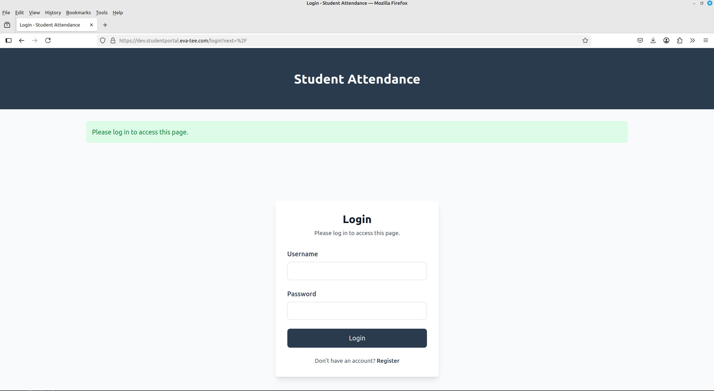
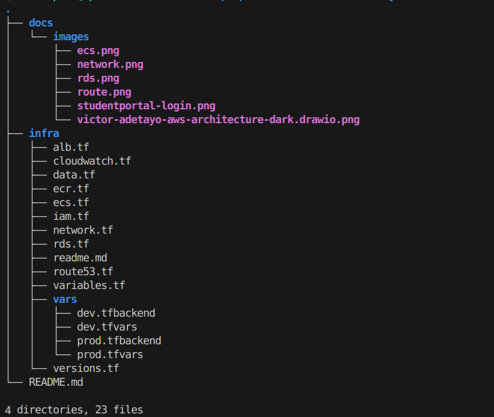

# 🚀 Terraform ECS Dynamic Multi-Environment Infrastructure

<p align="center">


</p>

A **production-ready Infrastructure as Code (IaC) project** demonstrating how to provision and manage a scalable, highly available containerized application platform on AWS using **Terraform**.

The project deploys a Dockerized Student Portal application onto **Amazon ECS Fargate**, fronted by an **Application Load Balancer**, secured with **HTTPS (ACM)**, backed by **Amazon RDS PostgreSQL**, and exposed through **Amazon Route 53**.

Designed with enterprise DevOps practices in mind, the infrastructure supports **multi-environment deployments (Development & Production)** from a **single Terraform codebase**, using environment-specific variables, remote state backends, and dynamic Terraform constructs.

---

# 📚 Table of Contents
- [Project Outputs](#-project-outputs)
- [Project Overview](#-project-overview)
- [Why This Project?](#-why-this-project?)
- [Architecture](#-architecture)
- [Project Metrics](#-project-metrics)
- [Key Features](#-key-features)
- [Technology Stack](#-technology-stack)
- [Terraform Design Decisions](#-terraform-design-decisions)
- [Skills Demonstrated](#-skills-demonstrated)
- [Engineering Challenges](#-engineering-challenges)
- [Deployment](#-deployment)
- [Auto Scaling and Load Testing](#-auto-scaling-and-load-testing)
- [Cleanup](#-cleanup)
- [Production Roadmap](#-production-roadmap)
- [Repository Structure](#-repository-structure)
- [Author](#-author)


---

# 📸 Project Outputs
The screenshots below confirm the end-to-end deployment: DNS resolving correctly, TLS certificate active, the ALB routing traffic to ECS, and the application successfully connecting to RDS.

---

## 🌐 Live Application

> **Development Environment**

```
https://dev.studentportal.eva-tee.com/login
```

---

## Application Screenshot



---


# 📖 Project Overview

This project demonstrates how to design and provision **production-ready AWS infrastructure** using **Terraform** and modern Infrastructure as Code (IaC) practices.

A single reusable Terraform codebase deploys both **Development** and **Production** environments by leveraging environment-specific variables, remote state backends, and dynamic Terraform constructs. The infrastructure provisions a complete containerized application platform on **Amazon ECS Fargate**, including an **Application Load Balancer**, **Amazon RDS PostgreSQL**, **Amazon Route 53**, **AWS Certificate Manager (ACM)**, **CloudWatch**, and secure networking components.

The project highlights practical Terraform techniques such as **`for_each`**, **variables**, **locals**, **maps**, remote state management, and environment-aware configuration to create scalable, maintainable, and repeatable cloud infrastructure.

It also demonstrates **ECS Service Auto Scaling**, allowing the application to automatically scale between **1 and 5 running tasks** based on CloudWatch CPU utilization.

---

# 🎯 Why This Project?

This project was built to demonstrate how modern cloud infrastructure can be designed, provisioned, and managed using **Infrastructure as Code**.

Rather than manually creating AWS resources, every component of the platform is defined declaratively using Terraform, enabling repeatable, consistent, and environment-aware deployments.

The project showcases practical experience with:

- Infrastructure as Code (Terraform)
- AWS Cloud Architecture
- Amazon ECS Fargate
- Application Load Balancers
- Amazon RDS
- Route53
- Cloud Networking
- Auto Scaling
- High Availability
- Secure Infrastructure Design
- Environment Isolation
- Infrastructure Automation

It reflects the engineering practices commonly used by Cloud, DevOps, and Platform Engineering teams to build scalable and maintainable AWS environments.

---

# 🏗 Architecture

The infrastructure follows a production-oriented AWS architecture designed for scalability, security, and maintainability. It provisions networking, compute, database, DNS, and load balancing resources using a single reusable Terraform codebase that supports both Development and Production environments.


### Architecture Highlights

- Multi-environment infrastructure
- HTTPS secured with ACM certificates
- DNS managed through Route53
- Public Application Load Balancer
- Private ECS Tasks
- Private Amazon RDS database
- ECS Auto Scaling
- Remote Terraform state
- Environment-aware deployments

---

# 📊 Project Metrics

| Metric | Value |
|---------|-------|
| Terraform Files | 10+ |
| AWS Services | 10+ |
| Deployment Environments | 2 |
| ECS Services | 1 |
| Maximum ECS Tasks | 5 |
| Infrastructure Provisioning | 100% Terraform |
| Remote State Backend | Amazon S3 |
| Infrastructure Pattern | Dynamic Multi-Environment |
| Deployment Strategy | Immutable Infrastructure |
| SSL Certificates | AWS ACM |

---


# ⭐ Key Features

- Multi-environment Terraform architecture
- Amazon ECS Fargate deployment
- Amazon RDS PostgreSQL
- HTTPS with ACM
- Route53 DNS
- ECS Auto Scaling
- Remote state in Amazon S3
- Dynamic Terraform resources using for_each

---

# 💻 Technology Stack

| Layer | Technology |
|--------|------------|
| Cloud Platform | AWS |
| Infrastructure as Code | Terraform |
| Container Platform | Amazon ECS Fargate |
| Database | Amazon RDS PostgreSQL |
| Load Balancer | Application Load Balancer |
| DNS | Amazon Route53 |
| SSL | AWS Certificate Manager |
| Monitoring | Amazon CloudWatch |
| Containers | Docker |
| State Management | Amazon S3 Backend |

---

# 🏗 Terraform Design Decisions

## Multi-Environment Architecture

A single Terraform codebase provisions both Development and Production environments using separate `.tfvars` and backend configuration files, eliminating duplicated infrastructure code.

## Dynamic Resource Creation

The infrastructure uses `for_each`, maps, and conditional expressions to provision environment-specific resources while keeping the codebase reusable and maintainable.

## Remote State Management

Terraform state is stored remotely in Amazon S3, enabling consistent deployments and collaborative infrastructure management.

## Environment Isolation

Each environment maintains its own backend, variables, networking configuration, and state to ensure independent deployments.

---

# 🛠 Skills Demonstrated

This project demonstrates practical experience with modern Cloud Engineering and Infrastructure as Code practices.
| Terraform | AWS | Architecture | DevOps |
|------------|-----|--------------|---------|
| Multi-Environment Deployments | Amazon ECS Fargate | High Availability | Infrastructure as Code |
| Dynamic Resources (`for_each`) | Amazon RDS | Environment Isolation | Infrastructure Automation |
| Remote State (Amazon S3) | Application Load Balancer | Secure Networking | Docker |
| Backend Configuration | Route 53 & ACM | Auto Scaling | Git |
| Variables, Locals & Maps | CloudWatch | Reusable Infrastructure | CI-Ready Infrastructure |

---

# 🛠 Engineering Challenges

Building production infrastructure is not only about provisioning AWS resources—it's also about troubleshooting, improving reliability, and designing infrastructure that can evolve over time.

During development, I encountered several real-world infrastructure issues and resolved them through iterative improvements.

| Challenge | Solution |
|------------|----------|
| Terraform working directory accidentally committed to Git | Updated `.gitignore` and removed Terraform state files from version control to maintain a clean repository. |
| ECS tasks failed with `CannotPullContainerError` | Corrected the Amazon ECR image URI referenced in the ECS task definition. |
| ECS tasks could not pull images from Amazon ECR | Added a NAT Gateway route for private subnets, enabling outbound internet connectivity. |
| NAT Gateway creation failed due to Elastic IP configuration | Replaced the Elastic IP data source with a managed Terraform resource. |
| Database connection string failed because of special characters in generated passwords | Updated the password generation strategy to produce application-compatible credentials. |

These challenges significantly improved the robustness, maintainability, and operational reliability of the infrastructure.

---

# 🚀 Deployment Guide

The infrastructure supports **Development** and **Production** deployments from a single Terraform codebase using environment-specific backend and variable files.

## Clone the Repository

```bash
git clone https://github.com/Evatee-coder/terraform-ecs-dynamic-multienv-infrastructure.git
cd terraform-ecs-dynamic-multienv-infrastructure/infra
```

## Configure AWS Credentials

```bash
aws configure
```

## Build and Push the Docker Image

Build the Student Portal Docker image and push it to your Amazon ECR repository before deploying the infrastructure.

## Deploy Development

```bash
terraform init -backend-config=vars/dev.tfbackend

terraform plan -var-file=vars/dev.tfvars

terraform apply -var-file=vars/dev.tfvars
```

## Deploy Production

```bash
terraform init -backend-config=vars/prod.tfbackend

terraform plan -var-file=vars/prod.tfvars

terraform apply -var-file=vars/prod.tfvars
```

> **Note:** A complete deployment typically takes **10–15 minutes**, with Amazon RDS provisioning accounting for most of the deployment time.

---

# 📈 Auto Scaling and Load Testing

The ECS service is configured with **AWS Application Auto Scaling** using a **Target Tracking Scaling Policy**.

Scaling decisions are based on average CPU utilization.

Configuration highlights:

- Minimum Tasks: **1**
- Maximum Tasks: **5**
- Automatic scale out
- Automatic scale in
- CloudWatch metric-driven scaling

This enables the application to automatically respond to changes in traffic without manual intervention.

---

## 🔥 Load Testing

Autoscaling behavior can be verified using containerized load-testing tools.

Using **hey**:

```bash
docker run --rm williamyeh/hey \
-n 1000 \
-c 200 \
https://dev.<subdomain>.<domain>.com/login
```

Using **load-test**:

```bash
docker run fjudith/load-test \
-h https://dev.<subdomain>.<domain>.com/login \
-c 10 \
-r 1000
```

Monitor scaling activity in the AWS Console:

```
Amazon ECS
    ↓
Cluster
    ↓
Service
    ↓
Metrics
```

The ECS service automatically adjusts the number of running tasks based on application load.

---
# 🧹 Cleanup

To remove deployed infrastructure, destroy the target environment.

Development

```bash
terraform init \
-backend-config=vars/dev.tfbackend

terraform destroy \
-var-file=vars/dev.tfvars
```

Production

```bash
terraform init \
-reconfigure \
-backend-config=vars/prod.tfbackend

terraform destroy \
-var-file=vars/prod.tfvars
```

---

# 🚀 Production Roadmap

Although the platform is production-ready, several enhancements could further improve scalability, resilience, and operational capabilities.

### Planned Improvements

- Blue/Green deployments
- Canary deployments
- AWS CodePipeline integration
- GitHub Actions deployment pipeline
- Amazon ElastiCache for Redis
- AWS WAF integration
- AWS Secrets Manager for application secrets
- CloudWatch dashboards
- AWS X-Ray tracing
- OpenTelemetry support
- Multi-region disaster recovery
- Terraform modules for improved reusability
- Automated security scanning
- Cost optimization dashboards

---

# 📂 Repository Structure



The infrastructure is organized into modular Terraform configuration files, making each AWS service easy to understand, maintain, and extend.

---

# 👨‍💻 Author

**Victor Adetayo Eyelade**

AWS Cloud & DevOps Engineer 

- **GitHub:** https://github.com/Evatee-coder
- **LinkedIn:** **www.linkedin.com/in/victor-adetayo-eyelade-a98606128**


If you found this repository useful or interesting, consider giving it a ⭐ to support the project.

If you'd like to discuss AWS, Terraform, DevOps, or Cloud Engineering, feel free to connect with me on LinkedIn or GitHub.

---


