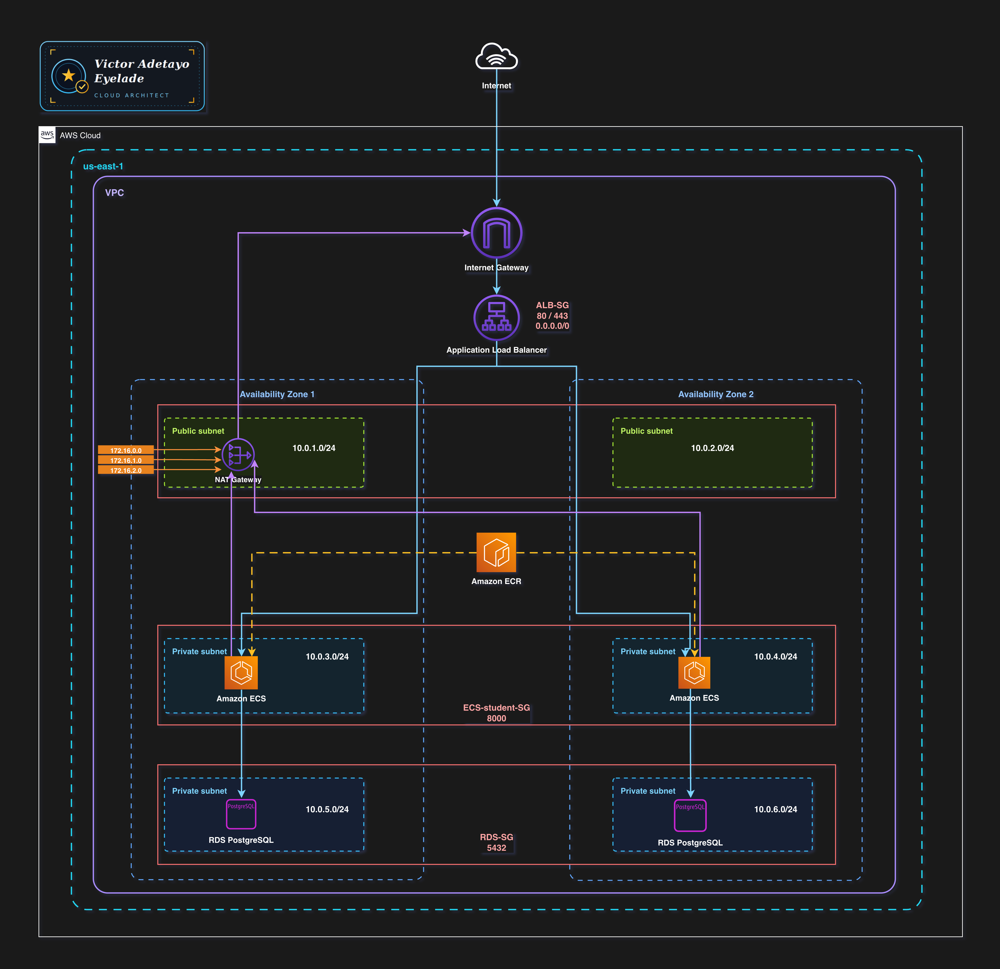

# 🚀 Terraform ECS Dynamic Multi-Environment Infrastructure

<p align="center">


</p>

A **production-ready Infrastructure as Code (IaC) project** demonstrating how to provision and manage a scalable, highly available containerized application platform on AWS using **Terraform**.

The project deploys a Dockerized Student Portal application onto **Amazon ECS Fargate**, fronted by an **Application Load Balancer**, secured with **HTTPS (ACM)**, backed by **Amazon RDS PostgreSQL**, and exposed through **Amazon Route 53**.

Designed with enterprise DevOps practices in mind, the infrastructure supports **multi-environment deployments (Development & Production)** from a **single Terraform codebase**, using environment-specific variables, remote state backends, and dynamic Terraform constructs.

---

# 📚 Table of Contents

- [Project Overview](#-project-overview)
- [Architecture](#-architecture)
- [Key Features](#-key-features)
- [Project Metrics](#-project-metrics)
- [Skills Demonstrated](#-skills-demonstrated)
- [Enterprise Practices](#-enterprise-practices)
- [Technology Stack](#-technology-stack)
- [Prerequisites](#-prerequisites)
- [AWS Requirements](#-aws-requirements)
- [Deployment Guide](#-deployment-guide)
- [Auto Scaling](#-auto-scaling)
- [Project Outputs](#-project-outputs)
- [Cleanup](#-cleanup)
- [Troubleshooting](#-troubleshooting)
- [Lessons Learned](#-lessons-learned)
- [Future Improvements](#-future-improvements)
- [Why This Project?](#-why-this-project)
- [Author](#-author)
- [License](#-license)

---

# 📖 Project Overview

This project demonstrates how modern AWS infrastructure can be provisioned, managed, and deployed entirely through **Terraform** while following Infrastructure as Code (IaC) best practices.

Rather than maintaining separate infrastructure definitions for different environments, the platform uses a **single reusable Terraform codebase** capable of deploying both **Development** and **Production** environments through environment-specific configuration files.

The infrastructure automatically provisions:

- Amazon ECS Fargate Cluster
- Application Load Balancer
- Amazon RDS PostgreSQL
- Amazon Route 53 DNS
- ACM SSL Certificates
- CloudWatch Logging
- IAM Roles
- Auto Scaling Policies
- VPC Networking
- Security Groups

Dynamic Terraform expressions including **variables**, **locals**, **maps**, **for_each**, **list indexing**, and **string interpolation** eliminate hardcoded values, allowing infrastructure to adapt automatically based on the selected deployment environment.

The project also demonstrates automatic ECS Service Auto Scaling driven by CloudWatch CPU metrics, enabling the application to scale between **1 and 5 running tasks** in response to workload demand.

---

# ⭐ Key Features

- Production-ready AWS infrastructure provisioned entirely with Terraform
- Multi-environment deployments (Development & Production)
- Single reusable Terraform codebase
- Environment-aware infrastructure configuration
- Amazon ECS Fargate deployment
- Application Load Balancer with HTTPS
- Amazon Route 53 DNS integration
- Amazon RDS PostgreSQL
- ECS Service Auto Scaling
- CloudWatch monitoring
- Secure IAM roles and policies
- Dynamic Terraform resources using `for_each`
- Remote Terraform state stored in Amazon S3
- Dockerized application deployment
- Infrastructure designed for scalability and maintainability

---

# 🏗 Architecture



### Architecture Overview

The application follows a production-oriented AWS architecture:

```
                    Internet
                        │
                        ▼
                 Amazon Route53
                        │
                        ▼
             Application Load Balancer
                        │
                        ▼
               Amazon ECS Fargate
                        │
                        ▼
               Student Portal Container
                        │
                        ▼
             Amazon RDS PostgreSQL
```

### Architecture Highlights

- Multi-environment infrastructure
- HTTPS secured with ACM certificates
- DNS managed through Route53
- Public Application Load Balancer
- Private ECS Tasks
- Private Amazon RDS database
- ECS Auto Scaling
- Remote Terraform state
- Environment-aware deployments

---

# 📊 Project Metrics

| Metric | Value |
|---------|-------|
| Terraform Files | 10+ |
| AWS Services | 10+ |
| Deployment Environments | 2 |
| ECS Services | 1 |
| Maximum ECS Tasks | 5 |
| Infrastructure Provisioning | 100% Terraform |
| Remote State Backend | Amazon S3 |
| Infrastructure Pattern | Dynamic Multi-Environment |
| Deployment Strategy | Immutable Infrastructure |
| SSL Certificates | AWS ACM |

---

# 🛠 Skills Demonstrated

This project demonstrates practical experience with modern Cloud Engineering and Infrastructure as Code practices.

### Infrastructure as Code

- Terraform
- Dynamic Resource Creation
- Variables
- Locals
- Maps
- for_each
- List Indexing
- String Interpolation
- Remote State Management
- Multi-Environment Infrastructure

### AWS Cloud

- Amazon ECS Fargate
- Amazon RDS
- Application Load Balancer
- Route53
- AWS Certificate Manager
- IAM
- CloudWatch
- Security Groups
- VPC Networking

### DevOps

- Docker
- Container Deployment
- Infrastructure Automation
- CI-ready Infrastructure
- Remote State
- Environment Separation
- Auto Scaling
- High Availability

### Security

- HTTPS Everywhere
- IAM Least Privilege
- Network Isolation
- Private Database
- Secure Resource Naming
- Environment Isolation

---

# 🏢 Enterprise Practices

The infrastructure follows engineering practices commonly adopted in production cloud environments.

✅ Infrastructure as Code (IaC)

✅ Environment Isolation

✅ Remote State Management

✅ Immutable Infrastructure

✅ Dynamic Resource Provisioning

✅ Infrastructure Reusability

✅ Auto Scaling

✅ HTTPS by Default

✅ Least Privilege IAM

✅ Secure Networking

✅ Production-ready Architecture

✅ Scalable Infrastructure

✅ Maintainable Terraform Modules

---

# 💻 Technology Stack

| Layer | Technology |
|--------|------------|
| Cloud Platform | AWS |
| Infrastructure as Code | Terraform |
| Container Platform | Amazon ECS Fargate |
| Database | Amazon RDS PostgreSQL |
| Load Balancer | Application Load Balancer |
| DNS | Amazon Route53 |
| SSL | AWS Certificate Manager |
| Monitoring | Amazon CloudWatch |
| Containers | Docker |
| State Management | Amazon S3 Backend |

---

# ⚙️ Prerequisites

Before deploying the infrastructure, ensure the following tools and AWS resources are available.

## Required Tools

| Tool | Version | Purpose |
|------|---------|---------|
| Terraform | >= 1.13 | Infrastructure provisioning |
| AWS CLI | v2.x | AWS authentication and resource management |
| Docker | Latest | Build and push the application image |
| Git | Latest | Clone the repository |

---

# ☁️ AWS Requirements

The following AWS resources must already exist before provisioning the infrastructure.

- AWS account with programmatic access
- Route 53 Public Hosted Zone
- Customer-managed AWS KMS Key
- Amazon S3 bucket for Terraform Remote State
- IAM user or role with permissions to provision AWS resources

The project expects separate KMS aliases for each environment:

| Environment | KMS Alias |
|------------|-----------|
| Development | `alias/dev-kms` |
| Production | `alias/prod-kms` |

Update the environment-specific configuration files if your AWS resources use different names.

---

# 📂 Repository Structure

```text
terraform-ecs-dynamic-multienv-infrastructure
│
├── advance-terraform/
│   ├── alb.tf
│   ├── ecs.tf
│   ├── iam.tf
│   ├── kms.tf
│   ├── network.tf
│   ├── rds.tf
│   ├── route53.tf
│   ├── security-groups.tf
│   ├── variables.tf
│   ├── locals.tf
│   ├── outputs.tf
│   ├── provider.tf
│   ├── versions.tf
│   └── vars/
│       ├── dev.tfvars
│       ├── prod.tfvars
│       ├── dev.tfbackend
│       └── prod.tfbackend
│
├── images/
│
└── README.md
```

The infrastructure is organized into modular Terraform configuration files, making each AWS service easy to understand, maintain, and extend.

---

# 🚀 Deployment Guide

The infrastructure can be deployed to either the **Development** or **Production** environment using the same Terraform codebase.

---

## 1️⃣ Clone the Repository

```bash
git clone https://github.com/Evatee-coder/terraform-ecs-dynamic-multienv-infrastructure.git

cd terraform-ecs-dynamic-multienv-infrastructure/advance-terraform
```

---

## 2️⃣ Configure AWS Credentials

Authenticate Terraform using the AWS CLI.

```bash
aws configure
```

Provide:

- AWS Access Key
- AWS Secret Access Key
- Default Region
- Output Format

---

## 3️⃣ Build and Push the Docker Image

Before provisioning ECS resources, the Student Portal container image must be available in Amazon ECR.

Authenticate Docker:

```bash
aws ecr get-login-password \
--region us-east-1 \
| docker login \
--username AWS \
--password-stdin \
<ACCOUNT_ID>.dkr.ecr.us-east-1.amazonaws.com
```

Tag the image:

```bash
docker tag student-portal:1.0 \
<ACCOUNT_ID>.dkr.ecr.us-east-1.amazonaws.com/student-portal:1.0
```

Push the image:

```bash
docker push \
<ACCOUNT_ID>.dkr.ecr.us-east-1.amazonaws.com/student-portal:1.0
```

---

## 4️⃣ Initialize Terraform

Each environment maintains an independent remote Terraform state.

Development:

```bash
terraform init \
-backend-config=vars/dev.tfbackend
```

Production:

```bash
terraform init \
-backend-config=vars/prod.tfbackend
```

---

## 5️⃣ Review the Execution Plan

Development

```bash
terraform plan \
-var-file=vars/dev.tfvars
```

Production

```bash
terraform plan \
-var-file=vars/prod.tfvars
```

---

## 6️⃣ Deploy the Infrastructure

Development

```bash
terraform apply \
-var-file=vars/dev.tfvars
```

Production

```bash
terraform apply \
-var-file=vars/prod.tfvars
```

Terraform provisions the complete AWS infrastructure including:

- VPC
- Subnets
- Internet Gateway
- Route Tables
- Security Groups
- Application Load Balancer
- ECS Cluster
- ECS Service
- ECS Task Definition
- IAM Roles
- Amazon RDS
- Route53 Records
- ACM Certificate

A fresh deployment typically completes within **10–15 minutes**, with Amazon RDS provisioning accounting for most of the deployment time.

---

# 📈 Auto Scaling

The ECS service is configured with **AWS Application Auto Scaling** using a **Target Tracking Scaling Policy**.

Scaling decisions are based on average CPU utilization.

Configuration highlights:

- Minimum Tasks: **1**
- Maximum Tasks: **5**
- Automatic scale out
- Automatic scale in
- CloudWatch metric-driven scaling

This enables the application to automatically respond to changes in traffic without manual intervention.

---

# 🔥 Load Testing

Autoscaling behavior can be verified using containerized load-testing tools.

Using **hey**:

```bash
docker run --rm williamyeh/hey \
-n 1000 \
-c 200 \
https://dev.<subdomain>.<domain>.com/login
```

Using **load-test**:

```bash
docker run fjudith/load-test \
-h https://dev.<subdomain>.<domain>.com/login \
-c 10 \
-r 1000
```

Monitor scaling activity in the AWS Console:

```
Amazon ECS
    ↓
Cluster
    ↓
Service
    ↓
Metrics
```

The ECS service automatically adjusts the number of running tasks based on application load.

---

# 📸 Project Outputs

The following screenshots demonstrate a successful end-to-end deployment.

Examples include:

- Application Login Page
- ECS Cluster
- ECS Service
- Running Tasks
- Application Load Balancer
- Route53 DNS
- Amazon RDS
- CloudWatch Metrics

---

## 🌐 Live Application

> **Development Environment**

```
https://dev.studentportal.eva-tee.com/login
```

---

## Application Screenshot


---

# 🧹 Cleanup

To remove deployed infrastructure, destroy the target environment.

Development

```bash
terraform init \
-backend-config=vars/dev.tfbackend

terraform destroy \
-var-file=vars/dev.tfvars
```

Production

```bash
terraform init \
-reconfigure \
-backend-config=vars/prod.tfbackend

terraform destroy \
-var-file=vars/prod.tfvars
```

---

### Important

Amazon RDS is configured with:

```
skip_final_snapshot = false
```

Before deleting the database, Terraform automatically creates a final snapshot.

Delete the snapshot manually from the AWS Console if it is no longer required to avoid unnecessary storage charges.

---

# 🛠 Engineering Challenges

Building production infrastructure is not only about provisioning AWS resources—it's also about troubleshooting, improving reliability, and designing infrastructure that can evolve over time.

During development, I encountered several real-world infrastructure issues and resolved them through iterative improvements.

| Challenge | Solution |
|------------|----------|
| Terraform working directory accidentally committed to Git | Updated `.gitignore` and removed Terraform state files from version control to maintain a clean repository. |
| ECS tasks failed with `CannotPullContainerError` | Corrected the Amazon ECR image URI referenced in the ECS task definition. |
| ECS tasks could not pull images from Amazon ECR | Added a NAT Gateway route for private subnets, enabling outbound internet connectivity. |
| NAT Gateway creation failed due to Elastic IP configuration | Replaced the Elastic IP data source with a managed Terraform resource. |
| Database connection string failed because of special characters in generated passwords | Updated the password generation strategy to produce application-compatible credentials. |

These challenges significantly improved the robustness, maintainability, and operational reliability of the infrastructure.

---

# 📚 Lessons Learned

This project reinforced several key Infrastructure as Code and Cloud Engineering principles.

- Infrastructure should be reproducible and version-controlled.
- Dynamic Terraform configurations eliminate duplicated code.
- Environment separation should be configuration-driven rather than code-driven.
- Networking mistakes are often the root cause of ECS deployment failures.
- Proper dependency management simplifies large Terraform projects.
- Infrastructure observability is just as important as application observability.
- Cloud automation greatly reduces operational overhead and deployment risk.

---

# 🚀 Future Improvements

Although the platform is production-ready, several enhancements could further improve scalability, resilience, and operational capabilities.

### Planned Improvements

- Blue/Green deployments
- Canary deployments
- AWS CodePipeline integration
- GitHub Actions deployment pipeline
- Amazon ElastiCache for Redis
- AWS WAF integration
- AWS Secrets Manager for application secrets
- CloudWatch dashboards
- AWS X-Ray tracing
- OpenTelemetry support
- Multi-region disaster recovery
- Terraform modules for improved reusability
- Automated security scanning
- Cost optimization dashboards

---

# 🎯 Why This Project?

This project was built to demonstrate how modern cloud infrastructure can be designed, provisioned, and managed using **Infrastructure as Code**.

Rather than manually creating AWS resources, every component of the platform is defined declaratively using Terraform, enabling repeatable, consistent, and environment-aware deployments.

The project showcases practical experience with:

- Infrastructure as Code (Terraform)
- AWS Cloud Architecture
- Amazon ECS Fargate
- Application Load Balancers
- Amazon RDS
- Route53
- Cloud Networking
- Auto Scaling
- High Availability
- Secure Infrastructure Design
- Environment Isolation
- Infrastructure Automation

It reflects the engineering practices commonly used by Cloud, DevOps, and Platform Engineering teams to build scalable and maintainable AWS environments.

---

# 🤝 Contributing

Contributions, improvements, and suggestions are welcome.

If you discover a bug or have an idea for improving the infrastructure, feel free to open an issue or submit a pull request.

---

# 👨‍💻 Author

**Victor Adetayo Eyelade**

AWS Cloud & DevOps Engineer 

- **GitHub:** https://github.com/Evatee-coder
- **LinkedIn:** **www.linkedin.com/in/victor-adetayo-eyelade-a98606128**


If you found this repository useful or interesting, consider giving it a ⭐ to support the project.

If you'd like to discuss AWS, Terraform, DevOps, or Cloud Engineering, feel free to connect with me on LinkedIn or GitHub.

---


